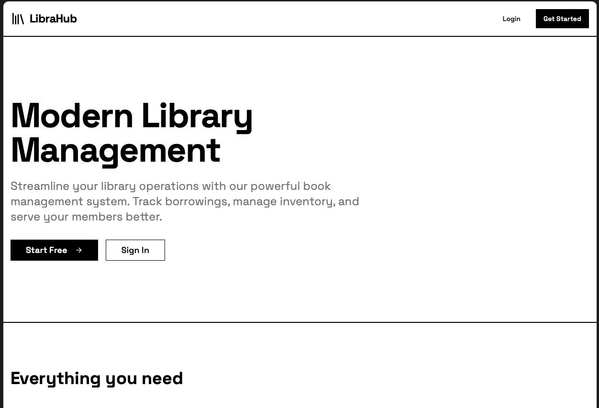

# Library Management System

A modern, full-stack library management application built with Ruby on Rails and React. Streamline your library operations with powerful book management, borrowing tracking, and member management features.



## Overview

Library Management is designed to help libraries of all sizes manage their book collections and member borrowings efficiently. The system provides two distinct user roles:

**For Librarians:**
- Add, edit, and delete books from the catalog
- Mark borrowed books as returned
- View total books and borrowing statistics
- Monitor overdue books and member activity

**For Members:**
- Browse and search the book catalog
- Borrow available books (one copy per book)
- View borrowed books with due dates
- Track overdue books and borrowing history

## Features

### Core Features
- **Book Management** - Add, edit, and manage your entire book collection with titles, authors, genres, ISBN numbers, and available copies
- **Borrowing System** - Seamlessly track book borrowings and returns with automatic due date calculation
- **Member Dashboard** - Personalized experience for library members to browse books and track borrowings
- **Role-Based Access** - Clear separation between librarian and member permissions

### Technical Features
- [Inertia Rails](https://inertia-rails.dev) & [Vite Rails](https://vite-ruby.netlify.app) setup
- [React](https://react.dev) frontend with TypeScript & [shadcn/ui](https://ui.shadcn.com) component library
- User authentication system with role-based access
- RESTful JSON API under `/api/v1` namespace
- Comprehensive test coverage with RSpec
- [Kamal](https://kamal-deploy.org/) for deployment (pending)

> 📖 **Development Process**: See [DEVELOPMENT_WORKFLOW_README.md](DEVELOPMENT_WORKFLOW_README.md) for details on the AI-assisted development workflow used to build this project.

## Setup

1. Clone this repository
2. Setup dependencies & run the server:
   ```bash
   bin/setup
   ```
3. Run migrations and seed the database:
   ```bash
   rails db:migrate
   rails db:seed
   ```
4. Open http://localhost:3000

## Test Credentials

The application includes test users with different roles:

### Librarian Account
- **Email:** librarian@demo.com
- **Username:** librarian_1
- **Password:** password123456
- **Role:** Librarian (full access to books, members, and API)

### Member Accounts
- **Email:** member@demo.com
- **Username:** member_1
- **Password:** password123456
- **Role:** Member (can browse books and manage borrowings)

Additional test members with overdue books are created during seeding for testing purposes.

## API Documentation

The application provides a RESTful JSON API under the `/api/v1` namespace. Librarians can access the full API documentation at `/api_docs` after signing in.

### Available Endpoints

**Books**
- `GET /api/v1/books` - List all books (supports ?query and ?filter parameters)
- `GET /api/v1/books/:id` - Get a specific book
- `POST /api/v1/books` - Create a book (librarian only)
- `PATCH /api/v1/books/:id` - Update a book (librarian only)
- `DELETE /api/v1/books/:id` - Delete a book (librarian only)

**Borrowings**
- `GET /api/v1/borrowings` - List borrowings (supports ?filter=due_today|overdue)
- `POST /api/v1/borrowings` - Borrow a book (requires user_id and book_id)
- `PATCH /api/v1/borrowings/:id/return` - Mark a book as returned

**Members**
- `GET /api/v1/members` - List all members (librarian only, supports ?filter=overdue)

### Example API Request

```bash
# List all books
curl http://localhost:3000/api/v1/books

# Create a borrowing
curl -X POST http://localhost:3000/api/v1/borrowings \
  -H "Content-Type: application/json" \
  -d '{"user_id": 1, "book_id": 1}'
```

## TODO

### High Priority
- [ ] Implement token-based authentication for API endpoints
- [ ] Add pagination to API responses
- [ ] Extract available books into a separate table so we can track how many copies of a book are available and they have a way to track physical copies of a book, i.e. barcodes or RFID tags

### Medium Priority
- [ ] Add email notifications for overdue books
- [ ] Add book cover image uploads
- [ ] Generate API usage statistics for librarians

### Low Priority
- [ ] Add book reviews and ratings
- [ ] Implement fine calculation for overdue books
- [ ] Add export functionality (CSV/PDF) for reports
- [ ] Add API rate limiting
